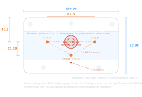
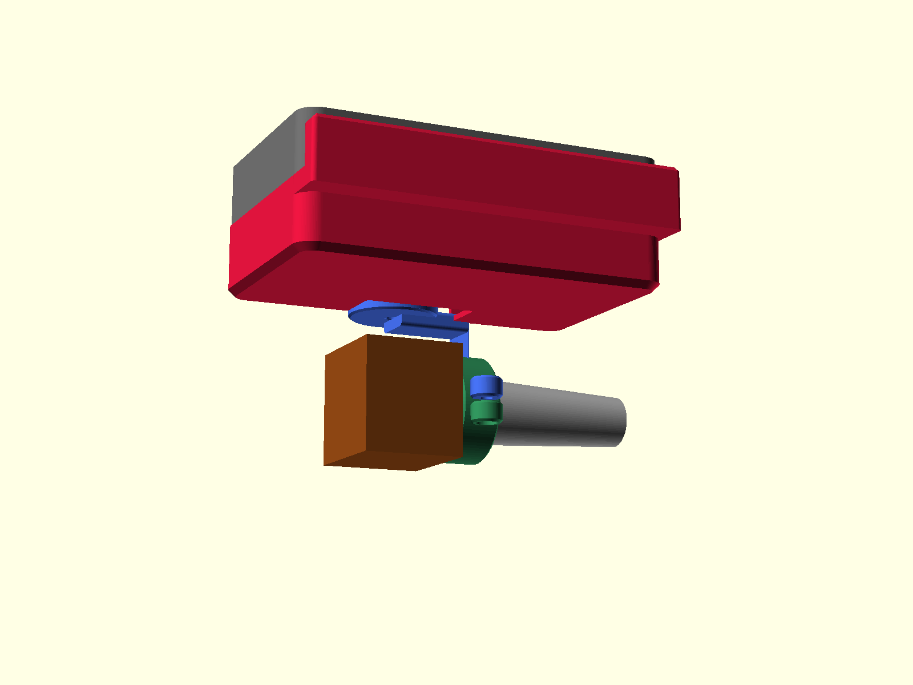
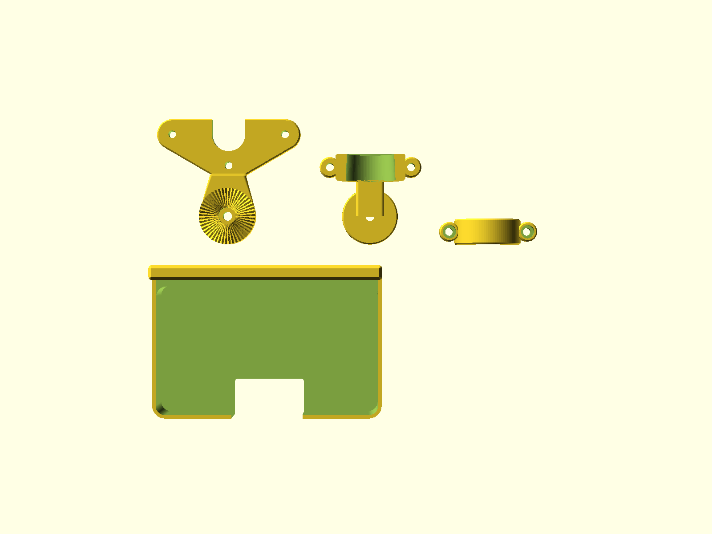

# Chaojie Gen 4 5" touchscreen — handlebar mount and rear cowl

A parametric, 3D-printable handlebar mount for the **Chaojie `CJ-V5-04`** 5" touchscreen display —
the panel sold with FarDriver controllers by E-Conic, EMF and others. It ships with no bracket of any
kind.

Four printed parts: a structural yoke that bolts to the display's three M5 inserts, a toothed-spline
tilt joint that **cannot creep**, a two-piece handlebar clamp, and a cosmetic rear cowl with an
integrated sun brow — because on a moped the back of this display faces the world.

<p align="center">
  
</p>

---

## ⛔ Do not print the yoke or arm yet

**The tilt joint does not tilt.** The spline's axis is the display's own normal while the handlebar
runs perpendicular to it, so the joint rolls the screen in its own plane instead of pitching it. The
mount's headline adjustment is on the wrong axis. Everything else — the hole pattern, the tapered
clamp bore, the spline's own meshing, mesh integrity — is verified and sound; the joint's
*orientation* is not. Fixing it means re-deriving the pivot placement, not changing a number.
Details in [docs/design-notes.md](docs/design-notes.md).

**The fit gauge is unaffected and still worth printing.**

## 🚧 Status

**Work in progress — not yet printable end to end.** Built and verified so far:

| Part | State |
|---|---|
| **Fit gauge** | ✅ done, **printed and proven on a real display** — [`stl/gen4-gauge.stl`](stl) |
| Face spline (tilt joint) | ✅ done — meshing proven geometrically |
| **Yoke** | ✅ done — [`stl/gen4-yoke.stl`](stl) |
| **Arm + clamp cap** | ✅ done — [`stl/gen4-arm.stl`](stl), [`stl/gen4-cap.stl`](stl). Bore is a tapered cone matching the bar (`docs/bike-fitment.md`); male spline proven against the yoke's female with `tools/check_fit.py` |
| **Cowl + sun brow** | ✅ done — [`stl/gen4-cowl.stl`](stl), [`stl/gen4-brow-test.stl`](stl). Clears the yoke, the arm and the display itself (proven with `tools/check_fit.py`, distinct boolean engine from the OpenSCAD/CGAL export); ⬜ **the 19mm brow projection is unproven — print `brow_test` and hold it against the screen on the bike before trusting it** |
| **Assembly renders + print plate** | ✅ done — [`renders/`](renders). Every part positioned as it actually assembles (display and handlebar shown as stand-ins, not printed), plus the 4 printable parts laid out flat in their print orientation. Clearance re-proven with `tools/check_fit.py` on the positioned exports |

**The fit gauge is printable today**, and it is the right thing to print first regardless (see below).
Watch the repo or check [CHANGELOG.md](CHANGELOG.md) for the rest.

<p align="center">
  
  
</p>

> These are plain OpenSCAD preview renders (`--viewall --autocenter`, no `--render`) — flat-coloured
> CAD shots, not photorealistic mocks. `tools/render-gen4.sh` rebuilds every STL and every PNG,
> including the assembly's iso/side/front views, from the current model.

---

## Does this fit my display?

It fits the **`CJ-V5-04`** — the 5", 800 × 480, DC 12–96 V panel with a `DJ7091A-2.8-11` 9-pin main
lead and a cable bundle emerging from the middle of its back.

It does **not** fit the 3" `CJ-V3-01` or the Gen 3 touchscreen; different housings, different hole
patterns.

Measure before you print. The drawing above is the whole test: three M5 holes, 81.0 mm apart with a
third 22.39 mm below the centre of that pair.

---

## Start here: print the fit gauge

Everything in this design hangs off the three-hole pattern. **Prove it on your own unit** before
printing anything larger:

```bash
# pre-built, or rebuild it yourself:
openscad -o stl/gen4-gauge.stl -D 'part="gauge"' src/gen4-display-mount.scad
```

Print it flat, no supports, any filament you have loaded. Then:

1. **Does it sit flat** on the raised band on the display's back, without rocking?
2. **Do three M5 × 12 bolts thread in** and pull the gauge tight — *by hand*, before any tool?
3. **Does the slot clear the cable boot** with the loom in place?

If all three pass, the hole pattern is proven and everything else can be built on it.

⚠️ **On question 2, the answer matters more than it looks.** Those inserts give **5 mm of usable
thread — one bolt diameter.** A bolt that bottoms out feels tight and is holding nothing at all. This
is why the gauge is 8 mm thick rather than a thin plate: at 8 mm it tests the exact engagement the
real parts use, instead of a proxy for it. See [docs/assembly.md](docs/assembly.md).

---

## Making it fit your bike

📄 **[docs/bike-fitment.md](docs/bike-fitment.md)** — what the clamp needs from your bar, and where
the screen ends up.

⚠️ **Measure the bar diameter at three points along the run, not one.** A single reading cannot tell a
tapered bar from a parallel one, and that decides whether the bore is a cone or a cylinder. On the
REVV1 FS the bar tapers **1:10** through the clamp zone — a cylindrical bore there would touch on a
line at one end only.

```openscad
bar_d0    = 32.0;   // Ø where the clamp's inboard face sits
bar_taper = 0.1;    // Ø lost per mm outward; 0 for a parallel bar
bar_run   = 20;     // usable straight length before the bar curves
arm_len   = 45;     // pivot above the bar centreline
```

Everything else is derived. Change a parameter and the model's `assert()` guards will stop the render
and name the constraint you broke, rather than quietly producing a part that does not work.

---

## Documentation

| | |
|---|---|
| **[docs/display-geometry.md](docs/display-geometry.md)** | Every measurement of the display's back, and the three things that catch people out. **Read this if you are designing your own bracket rather than printing ours** |
| **[docs/design-notes.md](docs/design-notes.md)** | The design constraints, and what each one protects |
| **[docs/bike-fitment.md](docs/bike-fitment.md)** | What the clamp needs from your handlebar, where the screen ends up, and how to adapt it to a different bar |
| **[docs/spline-verification.md](docs/spline-verification.md)** | How the tilt joint's teeth were proven to mesh — and why the obvious ways of checking give wrong answers |
| **[docs/printing.md](docs/printing.md)** | Material, per-part orientation, settings, print order |
| **[docs/assembly.md](docs/assembly.md)** | Hardware list, order of assembly, the 5 mm thread warning, setting the tilt |

## Layout

```
src/      gen4-display-mount.scad   — the whole model; every part, one file
stl/      pre-built exports
renders/  drawings and preview images
docs/     the four documents above
tools/    build.sh (export + verify single parts) · render-gen4.sh (STL + PNG
          for every part, the print plate and the assembly) · check_stl.py
```

## Building from source

Needs [OpenSCAD](https://openscad.org/) (developed against 2021.01) and Python 3.

```bash
./tools/build.sh
```

Exports every part and checks each bounding box. Individual parts:

```bash
openscad -o out.stl -D 'part="yoke"' src/gen4-display-mount.scad
```

Valid names: `gauge`, `spline_test`, `yoke`, `arm`, `cap`, `cowl`, `brow_test`, `plate` (the 4
printable parts laid out on one plate) and `assembly` (every part positioned as it actually
assembles, plus stand-ins for the display, the handlebar and the bracket it clamps to — not
fabricated, PNG only). An unrecognised name fails loudly on purpose.

```bash
./tools/render-gen4.sh
```

Rebuilds every single-part STL, the plate STL, and every PNG (single parts, the plate, and the
assembly's iso/side/front views) in one command.

---

## A note on the design's stubbornness

Three things in this model are guarded by assertions and should not be "simplified":

1. **The cable-boot slot opens upward.** A downward slot cuts off the lone M5.
2. **The pivot sits below the housing.** Anywhere higher and the toothed face covers that bolt's head,
   so it can never be fitted.
3. **Bolt length minus part thickness must land in 3–4 mm.** The thread is 5 mm deep.

[docs/design-notes.md](docs/design-notes.md) explains all three.

---

## Contributing

Issues and pull requests welcome — especially **measurements from other units**, which would upgrade
the drawing-derived figures to confirmed ones, and **photos of it fitted**. See
[CONTRIBUTING.md](CONTRIBUTING.md).

## Licence

[CC BY-SA 4.0](LICENSE). Print it, modify it, sell prints of it — credit the source and share your
changes under the same terms.

The Chaojie factory manual is **not** redistributed here; it is Chaojie's document. The measurements
derived from it are facts and are published freely.

## Disclaimer

This mounts an electronic display to a moving vehicle. Nothing here has been tested to any standard.
**Proof-load it before you trust it, and re-check every fastener after the first ride.** You are
responsible for what you bolt to your own bike.
