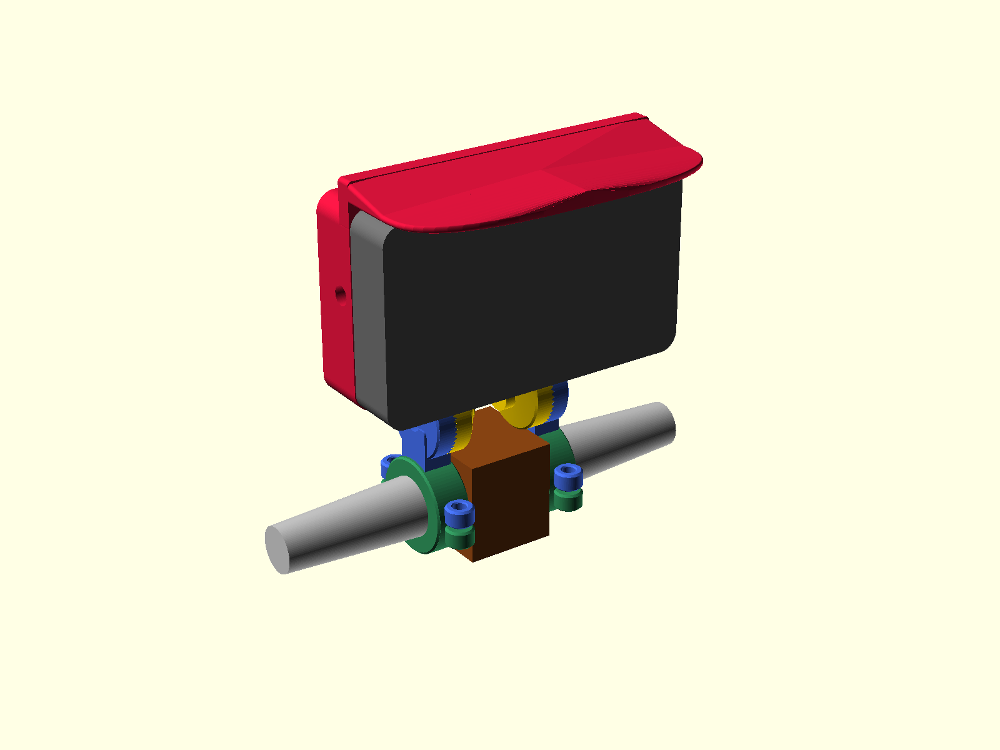
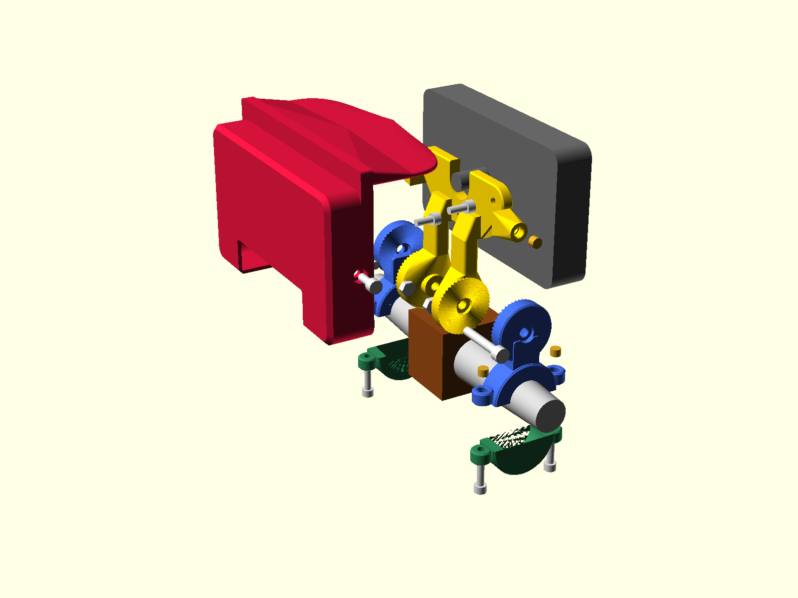
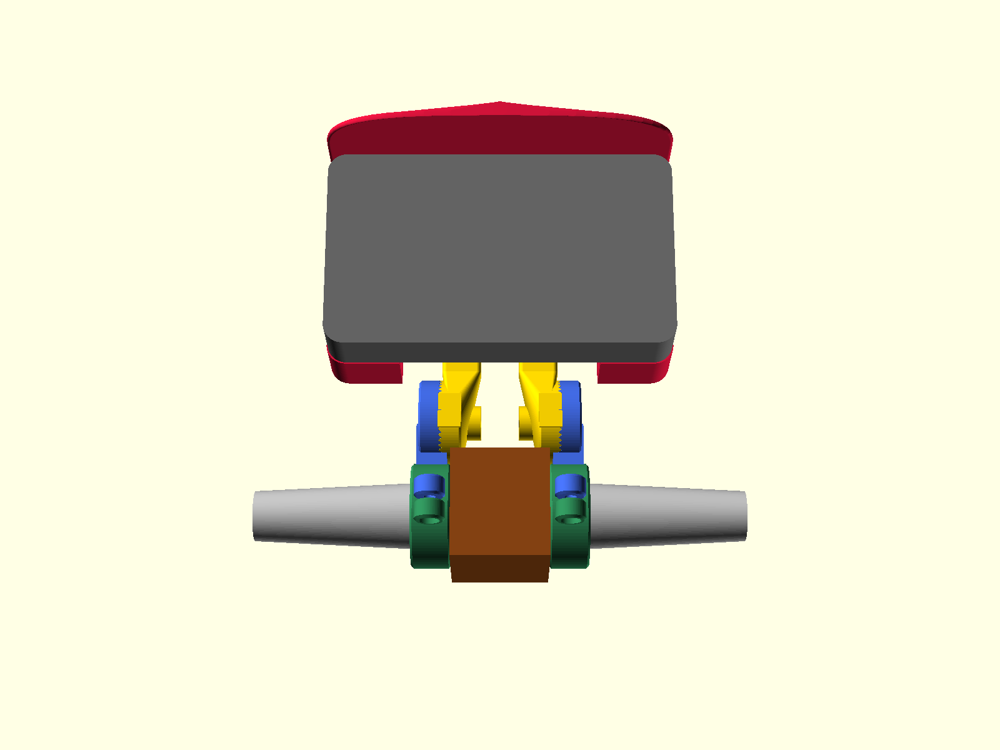

# Chaojie Gen 4 5" touchscreen — handlebar mount and rear cowl

A parametric, 3D-printable handlebar mount for the **Chaojie `CJ-V5-04`** 5" touchscreen display —
the panel sold with FarDriver controllers by E-Conic, EMF and others. It ships with no bracket.

<p align="center">
  
</p>

A structural **yoke** bolts to the display's three M5 inserts and carries a 48-tooth face-spline tilt
joint at **each** side, on one shared axis parallel to the bar. Two **clamps** grip the handlebar on
**both** sides of the centre bracket. A **cowl** encloses the back of the display and carries a sun
visor over the glass.

| | |
|---|---|
| Printed parts | 4 distinct, **6 on the bike** (the clamp arm and cap print twice) |
| Tilt | 48 teeth, **7.5° per click** |
| Screen height above the bar | bottom edge **52 mm**, top edge **146 mm** |
| Grip on the bar | **~81 mm** total, split either side of the steering axis |
| Sun visor | **33 mm** past the glass; shades **27.7 %** of the screen at 45° off the screen normal |
| Material | ASA (PC or PETG-CF also suitable) |
| Filament | **262 cm³** for the six printed parts — about 320 g in ASA |

---

## Exploded view

<p align="center">
  
</p>

| Colour | Item |
|---|---|
| Red | Cowl (printed) |
| Gold | Yoke (printed) |
| Blue | Clamp arm (printed, ×2) |
| Green | Clamp cap (printed, ×2) |
| Dark grey | Display — not printed |
| Silver / brown | Handlebar and its centre bracket — not printed |
| Brass | Heat-set inserts |

---

## Hardware

| Joint | Fastener | Count | Notes |
|---|---|---|---|
| Display → yoke | **M5 × 12** socket cap | 3 | ⚠️ **No washer, never longer.** The display's thread is 5 mm deep |
| Bar clamp, arm → cap | **M5 × 16** socket cap | 4 | Into inserts in the arm; heads counterbored into the cap's underside |
| Cowl → yoke | **M5 × 12** socket cap | 2 | Into inserts in the yoke's side ears; heads recess below the cowl's side face |
| Tilt pivot | **M6 × 35** + nyloc + plain washer | 2 | 26.0 mm grip, 7.3 mm into the nut |
| Heat-set inserts | **M5, Ø7 × 5 long** | 6 | 4 across the two arms (2 per arm), 2 in the yoke; buy spares |
| Clamp bore liner | inner-tube rubber strip | 2 | Protects the bar and takes up ovality |

Medium-strength threadlocker on the three display bolts.

**Insert placement.** Two per clamp arm, pressed into the top face of each ear. Two in the yoke,
pressed into the outer face of each side ear. None in the cap, none in the cowl.

⛔ **No insert at the tilt pivot.** The M6 runs up the spline's own Ø12 central bore; an M6 insert is
Ø8 and would leave 2 mm of wall in the middle of the tooth ring. It is also the only joint here loaded
purely in tension, where a through-bolt and nut put the plastic in compression between two steel
faces. Use the through-bolt.

### Bolt lengths are derived

Each length is computed from the stack it crosses and asserted in the model. Change a part thickness
and the render stops and names the size it now needs.

```
pivot_grip = leg_w/2 + yoke_tip_h + spline_seat + arm_tip_h − pivot_head_sink
           = 9 + 6 + 7.6 + 6 − 2.5  =  26.1 mm   →  M6 × 35 with a 1.6 mm washer
```

---

## Does this fit my display?

It fits the **`CJ-V5-04`** — the 5", 800 × 480, DC 12–96 V panel with a `DJ7091A-2.8-11` 9-pin main
lead and a cable bundle emerging from the middle of its back.

It does **not** fit the 3" `CJ-V3-01` or the Gen 3 touchscreen — different housings, different hole
patterns.

<p align="center">
  
</p>

Three M5 holes, 81.0 mm apart, with a third 22.39 mm below the centre of that pair. Full dimensions
in [docs/display-geometry.md](docs/display-geometry.md).

---

## Fitting it to your bar

The clamp bore is a **cone**, not a cylinder, because the REVV1 FS bar tapers 1:10 through the clamp
zone. Measure the diameter at three points along the run — a single reading cannot tell a tapered bar
from a parallel one.

```openscad
bar_d0    = 32.0;   // Ø where the clamp's inboard face sits
bar_taper = 0.1;    // Ø lost per mm outward; 0 for a parallel bar
bar_run   = 20;     // usable straight length before the bar curves
arm_len   = 45;     // pivot above the bar centreline
```

Everything else is derived. See [docs/bike-fitment.md](docs/bike-fitment.md).

---

## Printing

ASA, 0.2 mm layers (0.16 mm for the cowl), 4 walls minimum, 40–50 % infill on the yoke and arms. The
cowl is designed around a 2.4 mm wall — six perimeters at 0.4 mm.

**Print order:** `insert_coupon` → `gauge` → `brow_test` → `yoke` → `arm` + `cap` (×2 each) → `cowl`.

Per-part orientation, measured overhang figures and settings: [docs/printing.md](docs/printing.md).

<p align="center">
  
  
</p>

---

## Assembly

1. Press the six heat-set inserts — two in each clamp arm, two in the yoke.
2. Bolt the yoke to the display — three M5 × 12, run down by hand first, then threadlocker.
3. Fit a clamp to each side of the centre bracket, butting its faces.
4. Mesh each spline at the angle you want and run the M6 through with its washer and nyloc.
5. Hook the cowl's top lip over the display's top edge, rotate it down, and drive one M5 × 12 into
   each side.

Full sequence, tilt adjustment and the 5 mm-thread warning: [docs/assembly.md](docs/assembly.md).

---

## Documentation

| | |
|---|---|
| **[docs/display-geometry.md](docs/display-geometry.md)** | Every measurement of the display's back, and the three things that catch people out |
| **[docs/design-notes.md](docs/design-notes.md)** | The design constraints and what each one protects |
| **[docs/bike-fitment.md](docs/bike-fitment.md)** | What the clamp needs from your handlebar, and how to adapt it to a different bar |
| **[docs/spline-verification.md](docs/spline-verification.md)** | How the tilt joint's teeth were proven to mesh, and why the obvious checks give wrong answers |
| **[docs/printing.md](docs/printing.md)** | Material, per-part orientation, measured overhang, settings, print order |
| **[docs/assembly.md](docs/assembly.md)** | Hardware, order of assembly, setting the tilt |

## Layout

```
src/      gen4-display-mount.scad   — the whole model; every part, one file
stl/      pre-built exports
renders/  drawings and preview images
docs/     the six documents above
tools/    build.sh          export every part and run every gate
          render-gen4.sh    every STL and every PNG
          check_stl.py      bounding box
          check_fit.py      clearance, on a second boolean engine
          check_throat.py   smallest load-bearing section, angle-swept
          check_fixing.py   does a screw cross one part and land in the other
          check_shade.py    what the sun visor actually shades
          check_necks.py    erode the part and see what falls off
```

## Building from source

Needs [OpenSCAD](https://openscad.org/) (2021.01) and Python 3 with
`trimesh manifold3d numpy scipy networkx rtree`.

```bash
./tools/build.sh          # export every part, run every gate
./tools/render-gen4.sh    # the above, plus every PNG
openscad -o out.stl -D 'part="yoke"' src/gen4-display-mount.scad
```

Part names: `gauge`, `insert_coupon`, `spline_test`, `pivot_puck_test`, `yoke_leg_test`,
`yoke_plate_test`, `yoke`, `arm`, `cap`, `cowl`, `brow_test`, `plate`, `assembly`, `exploded`. An
unrecognised name fails loudly.

The build is gated on mesh integrity, fill against hand-computed expectations, minimum load-bearing
section over swept cutting planes, clearance between every part pair on a second boolean engine, that
the tilt joint pitches rather than rolls, that each screw crosses one part and lands in material in
the next, and what the sun visor measurably shades. Each gate has been run against geometry known to
be broken and confirmed to fail on it.

---

## Three things guarded by assertions

1. **The cable-boot slot opens upward.** A downward slot cuts off the lone M5.
2. **The pivot sits below the housing.** Anywhere higher and the toothed face covers that bolt's head.
3. **Bolt length minus part thickness lands in 3–4 mm.** The display's thread is 5 mm deep.

---

## Contributing

Issues and pull requests welcome — especially measurements from other units and photos of it fitted.
See [CONTRIBUTING.md](CONTRIBUTING.md).

## Licence

[CC BY-SA 4.0](LICENSE). Print it, modify it, sell prints of it — credit the source and share your
changes under the same terms.

The Chaojie factory manual is **not** redistributed here; it is Chaojie's document. The measurements
derived from it are facts and are published freely.

## Disclaimer

This mounts an electronic display to a moving vehicle. Nothing here has been tested to any standard.
**Proof-load it before you trust it, and re-check every fastener after the first ride.** You are
responsible for what you bolt to your own bike.
